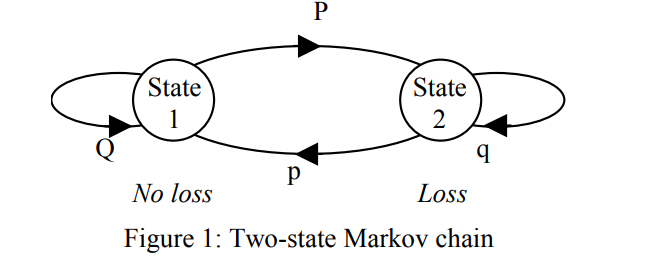
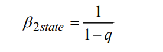

## Channel Analysis Methods

1. Switch channels in sender and receivers to match
2. Switch channel name to allow networks log to update accordingly

### packet loss models

To analyse the characteristics of a channel the most simple
measurement is

- the average probability of packet loss
- unconditional loss probability, α

The burstiness of packet loss can be measured by the conditional loss probability that a
packet is lost given that the previous packet was lost. This is
more usefully expressed as the average burst length of packet
loss, β.

### Two state Markov chain

The two-state Markov chain model of packet loss uses state 1
to represent a packet being correctly received and state 2 to
represent a packet being lost. Figure 1 illustrates the two-state
Markov chain which shows that its character is governed by
the self-loop probabilities of its two states Q and q.



The average packet loss burst length, β2state, produced by the
model is governed by the state 2 self-loop probability, q, and
is equal to its mean state duration which is given as



### Gantt chart 
Basic chart for now, to be finalised. 

```mermaid 

gantt 

title VoIP Coursework 
dateFormat DD-MM

section Tasks 
    Channel Analysis: 25-02,4d
    Design & Implementation: 01-03,7d
    Finish Report: 12-03,3d

